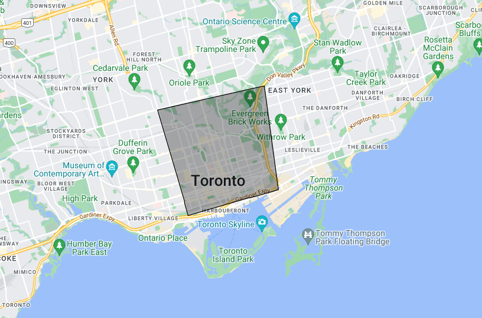

# Territory of Indonesia
This is a dataset project that currently covering all territory of Indonesia from level 4 to level 6 of administration level. This dataset based on OSM Database that released in August 8th, 2022

## How to use
You probably only need all files in `./dist` directory to be using in your project. This dataset provides such important data, but there're two most important, which are `OSM ID` and `Coordinates`.

- OSM ID used for getting higher administration level file. For example, After you get the list of provinces, you can get `OSM ID` from one of the list item. Then use it to get the list of districts for that respective province, and so on.
- Coordinates used for making a polygon of boundaries in 3rd party application such Google Maps.

## How Coordinates can be so important
As I mentioned above, it used for making polygon of boundaries. If you are using Google Maps Service, it allows you to draw a polygon that represents an area in the cartesian plane. For example:


## Why there are interface files
I hope, these interfaces can help when you have to Marshaling these jsons, into a struct or another data typed collections.

## What's next
I'm planning to change `Coordinates` struct from `3D array` into something like:
```json
{
    "coordinates": [
        { "lat": 0, "lng": 0 }
    ]
}
```

The reason is, when you need to create Google Maps' polygon, it has to use this format to be actually working. So I think, this decision is quite reasonable, so you don't have to reformat the data when you need to provide it into some `REST API` for example.